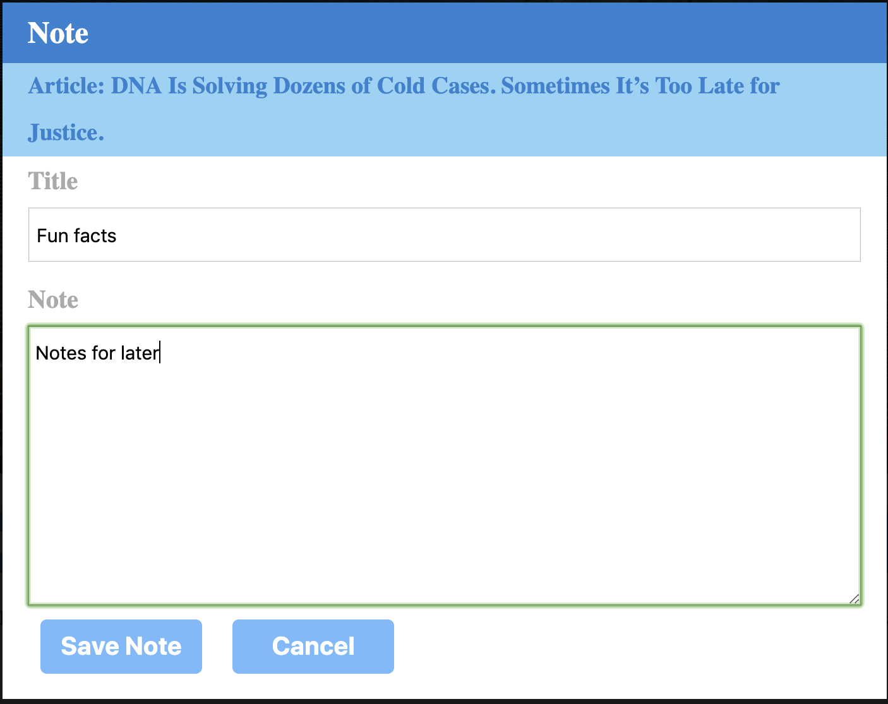

# Read-All-About-It

An web app that lets users view an leave comments on the latest news.

## Table of contents

* [About this project](#about-this-project)
* [Project requirements](#project-requirements)
* [Live](#live)
* [Structure of the project](#structure-of-the-project)
* [Screenshots](#screenshots)
* [Technologies used to create app](#technologies-used)
* [How to use the app](#how-to-use-app)

##  About this project

This project was to create an web app that lets users view and leave comments on the latest news. Using Mongoose and Cheerio to scrape news from another site.
 

##  Project requirements
* Whenever a user visits your site, the app should scrape stories from a news outlet of your choice and display them for the user. Each scraped article should be saved to your application database. At a minimum, the app should scrape and display the following information for each article:

     * Headline - the title of the article

     * Summary - a short summary of the article

     * URL - the url to the original article

     * Feel free to add more content to your database (photos, bylines, and so on).

* Users should also be able to leave comments on the articles displayed and revisit them later. The comments should be saved to the database as well and associated with their articles. Users should also be able to delete comments left on articles. All stored comments should be visible to every user.

##  Live
App is available live through GitHub and Heroku

* https://github.com/ATATE13/Read-All-About-It
* https://tranquil-harbor-84982.herokuapp.com/

##  Structure of the project
<ul>
<li>models</li>
    <li>Article.js</li>
    <li>Note.js</li>  
<li>node_modules</li>
<li>public</li>
    <ol>assets</ol>
        <ol>css</ol>
            <ol>style.css</ol>
        <ol>images</ol>
        <ol>javascript</ol>
            <ol>app.js</ol> 
<li>views</li>
    <ul>layouts</ul>
    <ul>main.handlebars</ul>
    <ul>index.handlebars</ul>
    <ul>placeholder.handlebars</ul> 
    <ul>saved.handlebars</ul>
    <ul>search.handlebars</ul>
<li>server.js</li>
</ul>

##  Screenshots
Images of Read-All-About-It site

##  Technologies used to create the app
* HTML5
* CSS
* Heroku (https://id.heroku.com/)
* Javascript (https://www.javascript.com/)
* JQuery (https://jquery.com/)
* Handlebars (https://handlebarsjs.com/)
* Node JS (https://nodejs.org/)
* Express (https://expressjs.com/)
* Mongo (https://www.mongodb.com/)

##  How to use app
* Once the app is deployed, select "Scrape For Newest Articles" to start the site grabing newest articles.
* The app will grab articles and display on the screen.
* Displayed on the screen will be headline, summary, URL and article photo
* The user is able to save the article for future review.
* The user is also able to add notes to saved articles.
* Additional buttons are also avaliable for the user to recall at a later time.

